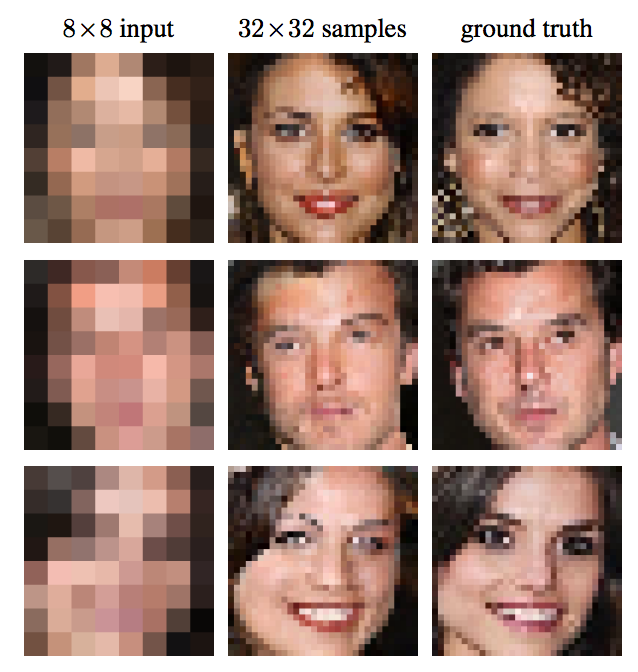
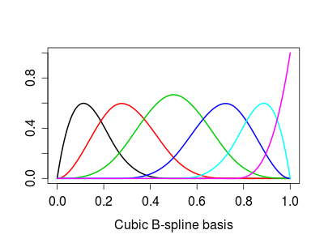
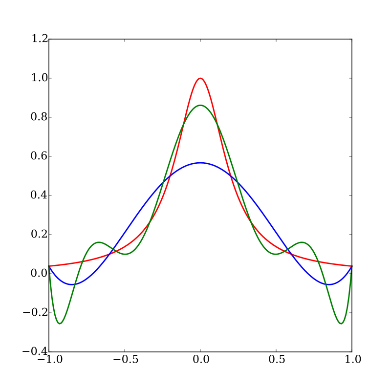
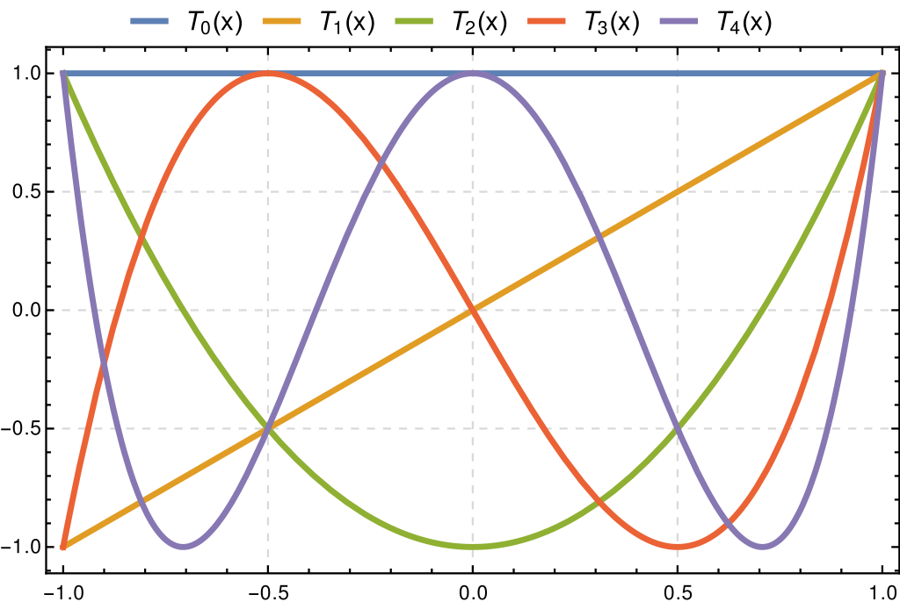

# Math topic: Interpolation

## Advanced Macro: Numerical Methods,  2022 (MIE37)

---

### Basics

Two continuous sets $X\in R^p$, $Y \in R^q$.


Data set: $(x_i, y_i)_{i\in[1,N]} \in X \times Y$

Take $\tilde{x} \in X \setminus \{x_i\}_{i\in[1,N]}$. What should be the matching $\tilde{y}$ ?


Discover implicit relation $y=f(x)$ (the model) then compute $\tilde{y}=f(\tilde{x})$.

$f$ is chosen from a family $\mathcal{F}$ of functions parameterized by a parameter $\theta$, the approximation family.


----

### Interpolation vs. Regression

- _Interpolation_: $f$ is chosen such that $\forall n, y_n=f(x_n)$
    <!-- - family ${f_{\theta}}$ is interpolating if $\forall n, \exists f \in \mathcal{F}, f(x_n)= y_n$ -->
- _Regression_: $f$ is chosen so as to minimize a fitness criterium such as
    - $\min_f \sum_n \left( y_n-f(x_n) \right)^2$
    - or $\min_{\theta} \sum_n \left( y_n-f(x_n;\theta) \right)^2 + \lambda  || \theta ||^2$ with $\lambda>0$
- Remarks:
    - some applied mathematicians tend to mix the two (interpolate=evaluate f outside of X)

----

### Examples (1): Linear Interpolation

1d Graph. Join the dots. Linear/Spline

2d Graph: Regression

Conclusion: interpolate only if $f$ is known precisely on $X$

----

### Example (2)




- $X$ and $Y$: large databases of low and high resolutions images
- $\mathcal{F}$: neural network

----

### Why do we need it?

- In economics, we often solve a problem $\Phi(f)=0$ where $f$ is a function: $\forall s, \Phi(f)(s) = 0$
- If we approximate $f$ by some element $f(;\theta)\in\mathcal{F}$ we just need to identify a finite set of parameters $\theta \in R^n$
- How do we identify $\theta$?
  - choose a finite set of $n$ criteria that must be met
    - $f$ is pin down uniquely
    - example: __colocation__, choose $s_1, ..., s_n$. Find $f$ such that $\forall i=1:n, \Phi(f)(s_i) = 0$
  - choose higher number of objectives ($p>n$) that must be minimized:
    - example: __regression__, choose $s_1, ..., s_p$. Find $f$ such that minimize $\sum_i \Phi(f)(s_i)^2 = 0$

----

### Several interpolation flavours

- local vs spectral:
    - local: functions in $f$ have compact support
    - spectral: noncompact support
- linear vs nonlinear:
    - $\mathcal{F}$ is a vector space: $f(x) \approx \sum_{i=1}^N \theta_n b_n(x)$ where $b_n$ is a base of $\mathcal{F}$
    - nonlinear: wavelets, neural networks, ....

---

## Splines

----

### Linear

- Take function $f$ defined on an interval $[a,b]$. Suppose the value is known at $(a=x_1, ... x_N=b)$. Denote $y_i = f(x_i)$.
- Join the dots: define a piecewise linear function as
$$\forall x \in [x_i, x_{i+1}], \tilde{f}(x) = y_i + \underbrace{\frac{x-x_i}{x_{i+1}-x_i}}\_{\text{barycentric coordinate}} (y_{i+1} - y_i)$$

[TODO: graph]

----

### Linear

- Alternate view:
$$\tilde{f}(x) = \sum_{i=1}^N y_i B^i_1(x)$$
where $b_1^i(x)=\frac{x-x_{i-1}}{x_i-x_{i-1}}.1_{x\in[x_{i-1},x_i]} + (1-\frac{x-x_{i}}{x_{i+1}-x_{i}}).1_{x\in [x_i, x_{i+1}]}$
- $(B^i)$ is an interpolation basis


----

### Splines

- $n$-th order *spline* : piecewise polynomial function that is $n$ times differentiable except on a finite set of break points (aka *knots*), where it is $(n-1)$ times differentiable.

- in practice the data points are the breakpoints

- example: order 2
    - suppose $\tilde{f}(x_i)$ and $\tilde{f}^{\prime}(x_i)$ are known, choose the coefficients for the patch $p_{i+1}(x) = a_{i+1}x^2+b_{i+1}x + c_{i+1}$
    - Already two constraints. Condition $p_{i+1}(x_{i+1})=\tilde{f}(x_{i+1})$ supplies another one.
    - Do it for every patch. Not that it requires to set $f^{\prime}(a)$ beforehand.

----

### Basis Splines (much better)

- Define
$$B_{i,1}(x) = 1_{x \in [x_i, x_{i+1}]}$$
$$B_{i,k+1}(x) = \frac{x-x_i}{x_{i+k}-x_i}B_{i,k}(x) + 
\frac{x_{i+k+1}-x}{x_{i+k+1}-x_{i+1}}B_{i+1,k}(x)$$
- Theorem: Any spline of order $k$ on the knots $(x_i)$ can be expressed as a linear combination of the basis splines $(B_{i,k})$.
- All basis splines have compact support.
- If grid is regularly spaced there is $B_k$ such that $B_{i,k}(x) = B_k(x-x_i)$

----

### Basis splines



----

### Basis splines are not interpolating

- Unfortunately basis splines are not "interpolating" in the sense that in general
   $$f(x_i) \neq \sum_{n} f(x_n) B_{n,k} (x_i)$$

- One must choose other coefficients $(c_n)$ which satisfy:

   $$y_i = \sum_n c_n B_{n,k} (x_i)$$

   - there are more coefficients than data points: requires boundary conditions  
     - f''=0: natural spline
   - going from $y_n$ to $c_n$ is called *prefiltering*

----

### In practice: Interpolations

```julia
f(x) = log(x)
xs = 1:0.2:5
A = [f(x) for x in xs]

# linear interpolation
interp_linear = LinearInterpolation(xs, A)
interp_linear(1.3) # interpolate

# cubic spline interpolation
interp_cubic = CubicSplineInterpolation(xs, A)
interp_cubic(1.3) # interpolate
```

----

### In practice: Interpolations (2)

Note that in  $y_i = \sum_n c_n B_{n,k} (x_i)$, $y_i$ and $c_n$ could perfectly well be vectors. If we use a Vector type which implements all operations (`zeros`, `*`, ...) we can interpolate them with the same operations

```julia
using StaticArrays

f(x) = SVector(log(x), exp(x))
xs = 1:0.2:5
A = [f(x) for x in xs]

# linear interpolation
interp_linear = LinearInterpolation(xs, A)
interp_linear(1.3) # returns a 2d SVector
```

---

### Mental break: matrix conditioning

----

### Matrix conditioning

- Suppose you want to solve vector equation $A x=y$. Will a small error in $y$ affect a lot the value of $x$? (in particular round-off errors)
    - condition number: $\lim_{\epsilon\rightarrow 0} \sup_{\delta y\leq \epsilon} \frac{\delta x}{\delta y}$
    - or $\kappa(A) = ||A^{-1}|| || A||$ where $|| ||$ is a subordonate norm.
    - if very-large: the matrix is ill conditioned
- What makes a matrix ill-conditioned?
    - some rows/columns are very small, others are gigantic
    - rows/columns are almost colinear

---

## Polynomial approximation

----

### Fitting polynomials

- Let's approximate: $f(;\theta) = \sum_{n=0}^K \theta_k x^k$.

- We need $(K+1)$ points to fit a polynomial of order $K$. Let's take grid points $(x_0, ... x_{K})$ and denote $y_k=f(x_k)$

- We need to solve in $(\theta_k)_{k=[0,K]}$:

$$\forall n \in[0,K],  \underbrace{\sum_k \theta_k (x_n)^{k}}_{M \theta} = y_k$$

----

### Vandermonde Matrix

- $M$ has a special structure, a Vencermode matrix:
$$
M = 
\begin{bmatrix}
1 & x_0 & x_0^2 \cdots & x_0^K \\\\
1 & x_1 & x_1^2  \cdots  & x_1^K \\\\
1 & x_2 & x_2^2  \cdots  & x_2^K \\\\
\vdots & \vdots & \ddots & \vdots \\\\
1 & x_K & x_K^2  \cdots & x_K^K
\end{bmatrix}
$$
- Vandermonde matrix is ill-conditioned if points are too close or if $K$ is high.

----

### Orthogonal polynomials

- Define a scalar product over functions on the domain $[a,b]$ by choosing a positive weight function $w(x)$.
$$<P,Q> = \int_a^b w(x) P(x)Q(x) dx$$

- Construct an orthogonal base $(T_n)_{n=[1,K]}$. 

- Approximate $$f(x)\approx f(x; \theta) = \sum_{n=0}^K \theta_n T_n(x)=\sum_{n=0}^K <f|T_n> T_n(x)$$

    - this is optimal for the norm associated to $<>$ (projection on the orthogonal base)


----

### Vandermonde matrix

Coefficients can still be identified by inverting: 
$$\forall n \in[0,K] \underbrace{\sum_k \theta_k T_k(x_n)}_{M \theta} = y_n$$


$$
M = 
\begin{bmatrix}
T_0(x_0) & T_1(x_0) & \cdots & T_K(x_0) \\\\
T_0(x_1) & T_1(x_1) &  \cdots  & T_K(x_1) \\\\
T_0(x_2) & T_1(x_2) &  \cdots  & T_K(x_2) \\\\
\vdots & \vdots & \ddots & \vdots \\
T_0(x_K) & T_1(x_K) &  \cdots & T_K(x_K)
\end{bmatrix}
$$

----

### Problem: Runge error

<div class="container">

<div class="col">

- Red: Runge function $f(x)=\frac{1}{1+25x^2}$
- Blue: interpolates at 6, regularly-spaced, points
- Green: interpolates at 10, regularly-spaced, points
- What happens when interpolation order increases?
  - oscillations increase.
- Does it contradict Stone-Weierstrass theorem ? No.
- Solutions:
  1. use regression method instead
  2. choose the interpolation points wisely

</div>

<div class="col">



</div>
</div>

----

### Chebychev Nodes

- There is an optimal way to choose the interpolation points:
    - the roots of $cos(\frac{2 k - 1}{2n} \pi)$ for [-1,1]
    - rescale for a finite interval [a,b]
- for the interpolating polynomial:
      $$|f(x) - P_n(x)|  \leq \frac{1}{2^n (n+1)!} \max_{\xi \in [-1,1]} |f^n(\xi)|$$

----

### Chebychev polynomials

- Chebychev polynomials (of the first kind) have their zeros on the nodes.
- Definitions:
    - $T_n(x) = \cos(n  \arccos(x))$ (in [0,1])
    - recursive: $T_0(x)=1$, $T_1(x)=x$, $T_n(x)=2 x T_{n-1}(x)-T_{n-2}(x)$

- Very good choice:
  - matrix $M$ is well conditioned: $\sqrt{2}$

----

### Chebychev Polynomial


---

## Additional topics

----

### Multidimensional interpolation

- Consider a function $f$ defined on a space $X_1 \times X_d$
- Take $d$ grids $\mathcal{G}_1\subset X_1, ..., \mathcal{G}_d\subset X_d$ with linear approximation bases $\mathcal{B}_1=(b_1^1, ... b_1^{N_1}),..., \mathcal{B}_d=(b_d^1, ... b_d^{N_d})$.
- Then $f$ can be approximated by
$f(x_1, ... x_d ; \theta) = \sum_{i_1=1}^{N_1} ... \sum_{i_d=1}^{N_d} \theta_{i_1, ... i_d} \underbrace{b_{i_1}^1(x_1) ...  b_{i_d}^d(x_d)}_{\text{Product Base}}$
- Morality:
  - linear appoximation along each dimension induces a natural (multi)-linear in many dimensions
  - Coefficients are still the solution of a linear system:
    $$M \theta = y$$
  - but $M$ has a special structure (tensor product)
- Problem: number of coefficients to determine increases exponentially with number of dimensions:
  - "Curse of Dimensionality"

----

### Multidimensional interpolation (2)

- Ways to mitigate the curse of dimensionality
- Remedies: 
    - sparse grids
    - adaptive approximation
    - neural networks
    - ...
- No black-magic theorem: *there is no solution to the curse of dimensionality*
  - .. but there are methods to adapt to problem whose intrinsic dimension is smaller than the actual number of variables

----

### In Practice: 

- `Interpolations.jl` can interepolate on multi-dim grids
- If you want to construct basis matrices yourself, `BasisMatrices.jl`:

```
using BasisMatrices
```

----